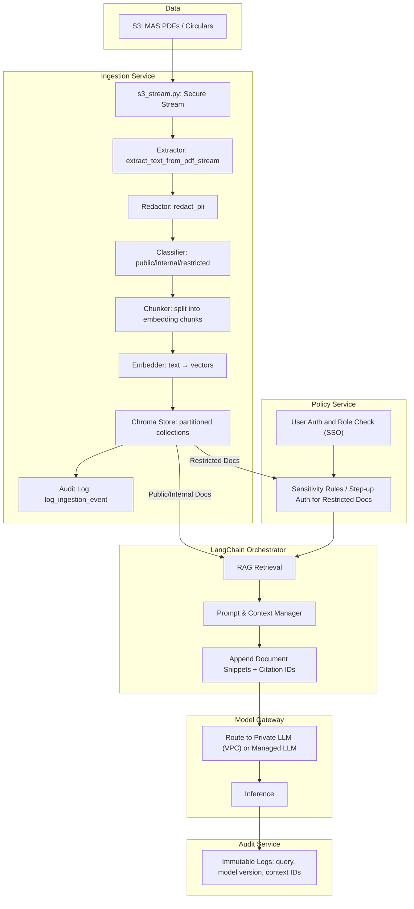

# compliance-ai
This Compliance Advisor system is driven with vector embeddings, LLMs, RAG, LangChain, MLOps etc to provide a chatbot capability to users governed by a government agency. 

##Target Architecture

```
compliance-ai/
├─ README.md
├─ infra/              # optional, handles VPC, KMS, vector DB, etc.
├─ services/
│  ├─ ingestion/       # transforms PDFs → vector embeddings
│  ├─ policy-service/  # handles user auth, step-up, sensitivity rules
│  ├─ orchestrator/    # LangChain / RAG orchestration
│  ├─ model-gateway/   # routes to private vs managed LLM
│  └─ audit-service/   # append-only logging of queries & model responses
├─ docs/               # architecture diagrams, playbooks
├─ tests/
├─ examples/
└─ .github/workflows/

```


## Data Ingestion
```
services/ingestion/
├─ src/
│  ├─ ingestion/
│  │  ├─ s3_stream.py
│  │  ├─ extractor.py
│  │  ├─ redactor.py
│  │  ├─ classifier.py
│  │  ├─ chunker.py
│  │  ├─ embedder.py
│  │  ├─ chroma_store.py
│  │  ├─ audit.py
│  │  └─ pipeline.py
│  └─ config.py
├─ ingest_cli.py
├─ requirements.txt
└─ Dockerfile
```
`pipeline.py` orchestrates all ingestion steps and serves as the **main entry point** for the system.

Each module follows the **single-responsibility principle** for clarity and maintainability:

## 🔧 Modules

- **`s3_stream.py`** – Secure streaming of documents from Amazon S3.
- **`extractor.py`** – Parses and extracts text from PDF files.
- **`redactor.py`** – Performs PII redaction to ensure privacy compliance.
- **`classifier.py`** – Classifies content based on sensitivity levels.
- **`chunker.py`** – Splits text into embedding-ready chunks.
- **`embedder.py`** – Converts text chunks into vector embeddings.
- **`chroma_store.py`** – Stores embeddings in partitioned Chroma collections.
- **`audit.py`** – Logs ingestion events to DynamoDB or stdout (configurable).
- **`ingest_cli.py`** – CLI entry point for triggering ingestion locally or within containers.

## 🚀 Usage

To run the ingestion pipeline locally or in a containerized environment:

```bash
python ingest_cli.py --source s3 --bucket your-bucket-name
